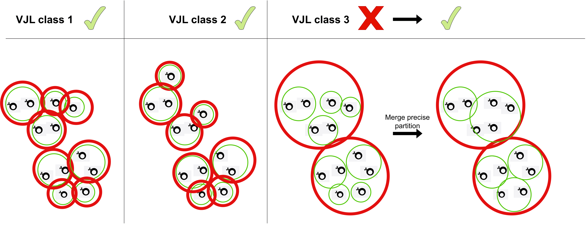

# 0. Installation

`pip install hilary`

# 1. Usage

### 1.1 Inputs

Inputs needs to be a tsv or excel file in airr format, meaning with the following columns :

| sequence_id | v_call      | j_call   | junction  | v_sequence_alignment | j_sequence_alignment | v_germline_alignment | j_germline_alignment |
| ----------- | ----------- | -------- | --------- | -------------------- | -------------------- | -------------------- | -------------------- |
| 1           | IGHV1-34*01 | IGHJ3*01 | TGTGCAACC | TTAGTACTT            | TTGCTTACT            | AGCACAGCC            | TTGCTTACT            |
| 2           | IGHV1-18*01 | IGHJ4*01 | TGTGCAAGA | TTAATCCTA            | GCTATGGAC            | TTAATCCTA            | GCTATGGAC            |
| 3           | IGHV1-74*01 | IGHJ4*01 | TGTGCAAGA | CATGCAACT            | GCTATGGAC            | CTACAATCA            | GCTATGGAC            |
| 4           | IGHV5-17*01 | IGHJ4*01 | TGTGCAAGA | CCCTGTTCC            | CTATGCTATGG          | GAGGTGTTC            | CTATGCTAT            |

### 1.2 From the command line

Hilary currently sypports three methods. A standard method performing single linkage clustering with fixed threshold on CDR3 pairwise Hamming distances. A method performing single linkage clustering with adaptive threshold on CDR3 Hamming distances (HILARy-CDR3). The full method performing single linkage clustering with adaptive threshold and using mutations in templated V and J regions (HILARy-full). Here are the different methods :

```
infer-lineages --help
Usage: infer-lineages [OPTIONS] COMMAND [ARGS]...

Options:
  --help  Show this message and exit.

Commands:
  crude-method  Infer lineages with Standard method from data_path excel file.
  cdr3-method   Infer lineages with HILARy-CDR3 from data_path excel file.
  full-method   Infer lineages with HILARy-full from data_path excel file.
```

To get the options of the full method for example :

```
infer-lineages full-method --help
Usage: infer-lineages full-method [OPTIONS] DATA_PATH

  Infer lineages with HILARy-full from data_path excel file.

Arguments:
  DATA_PATH  Path of the excel file to infer lineages.  [required]

Options:
  --kappa-file PATH        Path of the kappa chain file, hilary will
                           automatically use its paired option.
  -v, --verbose            Set logging verbosity level.  [default: 0]
  -t, --threads INTEGER    Choose number of cpus on which to run code. -1 to
                           use all available cpus.  [default: 1]
  -p, --precision FLOAT    Choose desired precision.  [default: 1]
  -s, --sensitivity FLOAT  Choose desired sensitivity.  [default: 0.9]
  --silent                 Do not show progress bars if used.
  --result-folder PATH     Where to save the result files. By default it will
                           be saved in a 'result/' folder.
  --config PATH            Configuration file for column names. File should be
                           a json with keys as your             data's column
                           names and values as hilary's required column names.
  --override               Override existing results.
  --json / --text          Print logs as JSON or text.  [default: text]
  --without-heuristic      DO not use heuristic for choosing the xy threshold.
  --help                   Show this message and exit.
```

**example :** `infer-lineages full-method /home/gabrielathenes/Documents/study/exemple.xlsx`

### 1.3 From Python

See `tutorial.ipynb`

# 2. Functional description of HILARy

## 2.1 CDR3-based inferrence method with adaptive threshold
### Step 1
1. Sequences are first filtered (are removed non productive sequences, null values ect) and then grouped by VJl class (sequences having same V gene, J gene and CDR3 length).
2. For each VJl class, the histogram of pairwise distances is computed.
3. We hypothesize that for a given VJl class, the distribution of pairwise distances $P$ is the $\rho$ weighted average of two distributions, a Poisson distribution $P_\mu \sim Pois(l\mu)$ representing related sequences and a null distribution $P_0$ representing non related sequences and identical for all classes and computed using Sonnia.
$$P(x)=\rho P_\mu + (1-\rho) P_0$$
Please note that even though $P_\mu$ is of parameter $l\mu$, only $\mu$ needs to be inferred as $l$ is known.
We finally estimate $\rho$ and $\mu$ for each class using an expectation-maximization algorithm.

**Summary of step 1**


### Step 2

4. For a given class, we can now compute precision and sensitivity just from the inferred distribution $P$ (we know the distribution of related sequences $P_\mu$, the distribution of unrelated sequences $P_0$ and the weight $\rho$.)
5. For a given precision $\pi^{\star}$ we compute a threshold $t^\star$.
6. This threshold used by a single clustering algorithm to build a partition with precision $\pi^{\star}$. The single linkage algorithm adds a sequence $s_1$ in a cluster if a member $s_2$ is such that the hamming distance of the CDR3s of $s_1$ and $s_2$ is smaller than $l t^{\star}$. (Note that since inside a VJl class their CDR3s have same length $l$.)

**Summary of step 2**


## 2.2 Incorporating phylogenetic signal

For a wide range of parameters, the method is predicted to achieve both high precision and high sensitivity. However, it is expected to fail when the prevalence and the CDR3 length are both low. HILARy therefore uses the number of shared mutations to upgrade sensitivity for low.

For each class, compute a high sensitivity (>90%) partition exactly like in step 2 but replacing precision with sensitivity. If the partition coincides with a high precision partition, then the partition is precise and sensitive and nothing needs to be done. Otherwise, we make the partition more precise by removing false positives. To do so we compute two variables $x'$ and $y$ coding respectfully for CDR3 divergence and number of mutations. We then classify pairs as related when $y-x'> t$ (resp. unrelated when <) with $t$ chosen to achieve high precision similarly than for the CDR3-based method.

**Summary**

